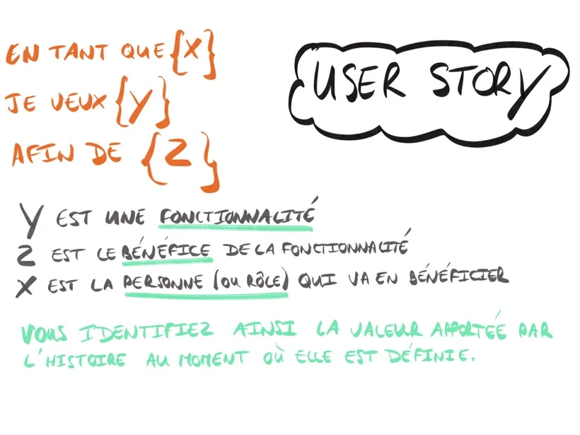

# Scrum 🏹

**Scrum** is a framework for developing, delivering, and sustaining complex products.

---

## C'est quoi ❓

> Scrum (n): A framework within which people can address complex adaptive problems, while
> productively and creatively delivering products of the highest possible value.

Scrum is:

- **Lightweight**
- **Simple** to understand
- **Difficult** to master

---

## Values 📕

- commitment
- courage
- focus
- openness
- respect

---

## Events 💥

### Sprint

The heart of Scrum is a **Sprint**, a time-box of one month or less during which a “Done”, useable, and potentially releasable product Increment is created. Sprints have consistent durations throughout a development effort. A new Sprint starts immediately after the conclusion of the previous Sprint.

During the Sprint:

- **No changes** are made that would endanger the Sprint Goal;
- **Quality goals** do not decrease;
- **Scope may be clarified and re-negotiated** between the Product Owner and Development Team as more is learned.

### Daily Scrum

The **Daily Scrum** is a 15-minute time-boxed event for the Development Team. The Daily Scrum is held every day of the Sprint. At it, the Development Team plans work for the next 24 hours. This optimizes team collaboration and performance by inspecting the work since the last Daily Scrum and forecasting upcoming Sprint work. The Daily Scrum is held at the same time and place each day to reduce complexity.

> Here is an example of what might be used:
>
> - What did I do yesterday that helped the Development Team meet the Sprint Goal?
> - What will I do today to help the Development Team meet the Sprint Goal?
> - Do I see any impediment that prevents me or the Development Team from meeting the Sprint Goal?

### Sprint Review

A **Sprint Review** is held at the end of the Sprint to inspect the Increment and adapt the Product Backlog if needed. During the Sprint Review, the Scrum Team and stakeholders collaborate about what was done in the Sprint.

The Sprint Review includes the following elements:

- The Product Owner explains what Product Backlog items have been “Done” and what has not been “Done”;
- The Development Team discusses what went well during the Sprint, what problems it ran into, and how those problems were solved;
- The Development Team demonstrates the work that it has “Done” and answers questions about the Increment;
- The entire group collaborates on what to do next, so that the Sprint Review provides valuable input to subsequent Sprint Planning;
- Review of how the marketplace or potential use of the product might have changed what is the most valuable thing to do next; and,
- Review of the timeline, budget, potential capabilities, and marketplace for the next anticipated releases of functionality or capability of the product.

---

## Chez Morice 🐧

### Sprints 🏃‍♂️

Chez Morice les sprints dure **2 semaines**. Et vont du _Mardi soir_ au _Mardi soir_.

### Daily Scrum 📰

Les **daily Scrum** ont lieu tous les **lundi et mardi à 10h**.

Un **Week Scrum** à lieu tous les **vendredi à 18h**.

> Exemple pour le Week Scrum:
>
> - What did I do this week that helped the Development Team meet the Sprint Goal?
> - What will I do next week to help the Development Team meet the Sprint Goal?
> - Do I see any impediment that prevents me or the Development Team from meeting the Sprint Goal?

### Ticket creation ✔

Les tâches du backlog seront toutes rédigé selon la nomenclature d'une **User Story**.

> Structure d'une User Story:
>
> - En tant que ...
> - Je veux ...
> - Afin de ...
>
> 

### Jira 🐱‍💻

**Project Name :** Morice-Sprint

**Project Code :** MORS

| Nom              | Utilité                                     | Comment ça marche ?                                                                                                                   |
| ---------------- | ------------------------------------------- | ------------------------------------------------------------------------------------------------------------------------------------- |
| Feuille de Route | Roadmap du projet à long terme              | Création d'un **épic** et définition de la date de début et de fin.                                                                   |
| Backlog          | Ensemble des tâche (User Stories) du projet | Création des tickets. ❗ Ne pas oublier d'assigner un **responsable** à chaque ticket et un **Story Point** _(compris entre 0 et 20)_ |
| Tableau          | Tableau de kanban du sprint en cours        | Drag & Drop les tickets pour les faire avancer de **ToDo** ➡ **In Progress** ➡ **Done**                                               |
| --               | --                                          | --                                                                                                                                    |

---

**Made by Guillaume with ❤.**
