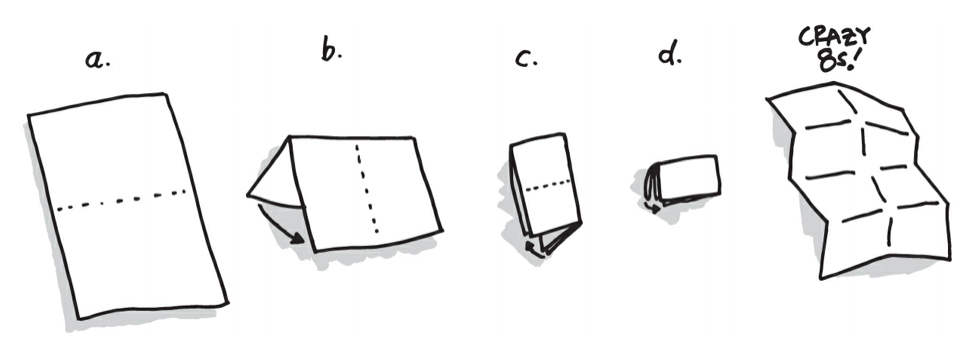

# Crazy 8 🕗

Le **Crazy 8** est un excellent atelier en Design Thinking permettant de s’imposer de diverger et de trouver plusieurs réponses à un problème. Cet atelier est ludique, facile à mettre en place et permet de se remettre soit même en question.

---

## Préparation 📄

### 1. Le materiel

Le crazy 8 est très simple à mettre en place. Il vous suffit de prendre une feuille A4 et de la plier selon les étapes décrites en images ci-dessous :

Chaque participant va préparer sa feuille de crazy 8 afin de pouvoir développer leurs idées.

### 2. Les participants

Conviez **maximum 5** participants à cet atelier. Au delà, l’animation devient difficile et la phase de convergence peut être vécue comme une douleur.

---

## Déroulé de l'atelier 🎢

### 1. Introduction _(5/10 min)_

En début d’atelier, il est essentiel de rappeler le contexte, les features sur lesquelles vous allez travailler, ainsi que le déroulé de l’atelier.

### 2. Dessin _(10 min)_

Les participants on chacun une minute pour écrire/dessiner une solution dans une des cases de leur feuille.  
A la fin de la minute, ils échangent tous leur feuille avec leur voisins de droite et doivent trouver une nouvelle idée.

> Ils peuvent s'inspirer des cases des autres participants

### 3. Récapitulatif _(5 min)_

Une fois les 8 cases de chaque feuille complété, il est temps de mettre en commun toute les idées. Ecrivez sur un post-it toute les idées qui sont sortie du crazy 8 et collé les sur une matrice [impact effort](./impact-effort.md)

---

**Made by Guillaume with ❤.**
