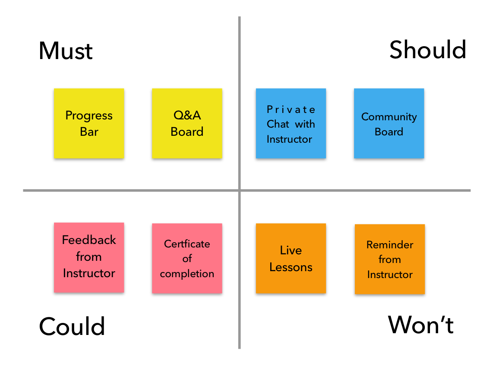

# MoSCoW 🏰

**MoSCoW** est une méthode de priorisation des features par analyse de leur importance.

---

## Comment ça marche ? 💡

La méthode de **MoSCoW** permet de prioriser les user stories à moyen terme selon les critères suivants :

- **M – Must have :** doit être réalisée.
- **S – Should have :** devrait être réalisée si possible.
- **C – Could have :** pourrait être réalisée s’il n’y a pas d’impact sur les autres tâches en cours.
- **W – Won’t have :** ne sera pas réalisée tout de suite mais serait souhaitable pour une version ultérieure.

---

## Example de présentation 🏃‍

---

**Made by Guillaume with ❤.**
