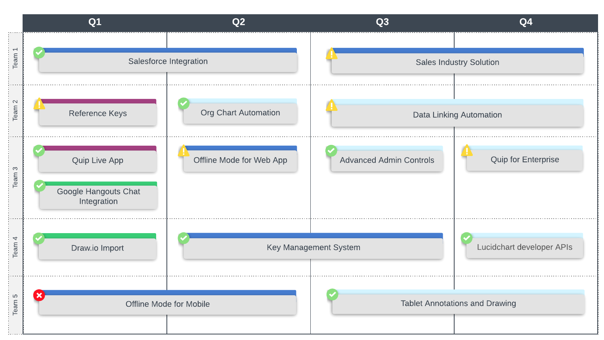
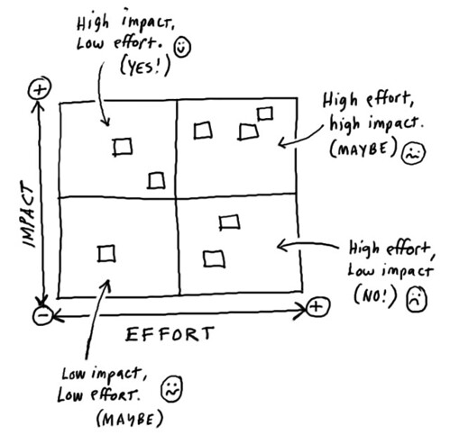
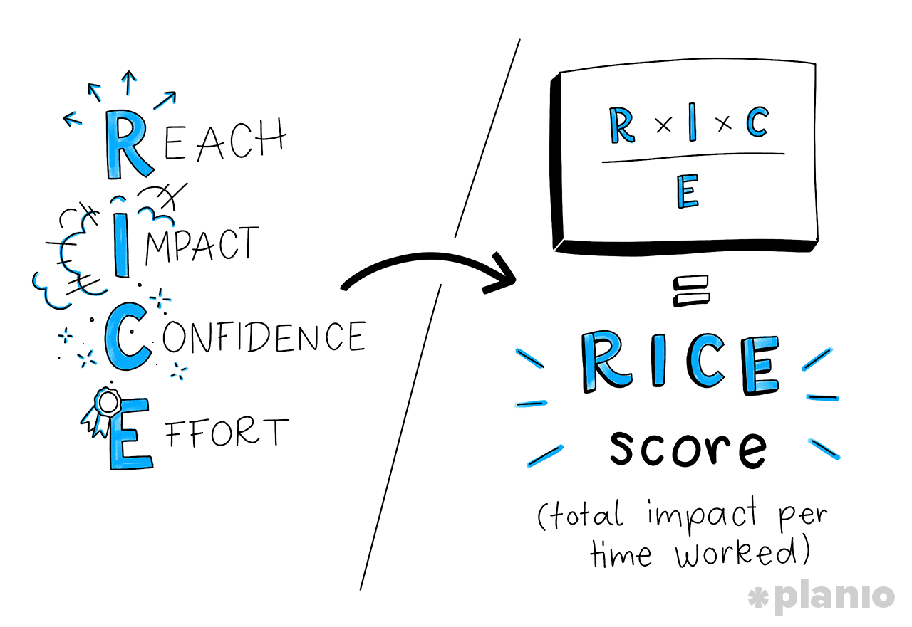
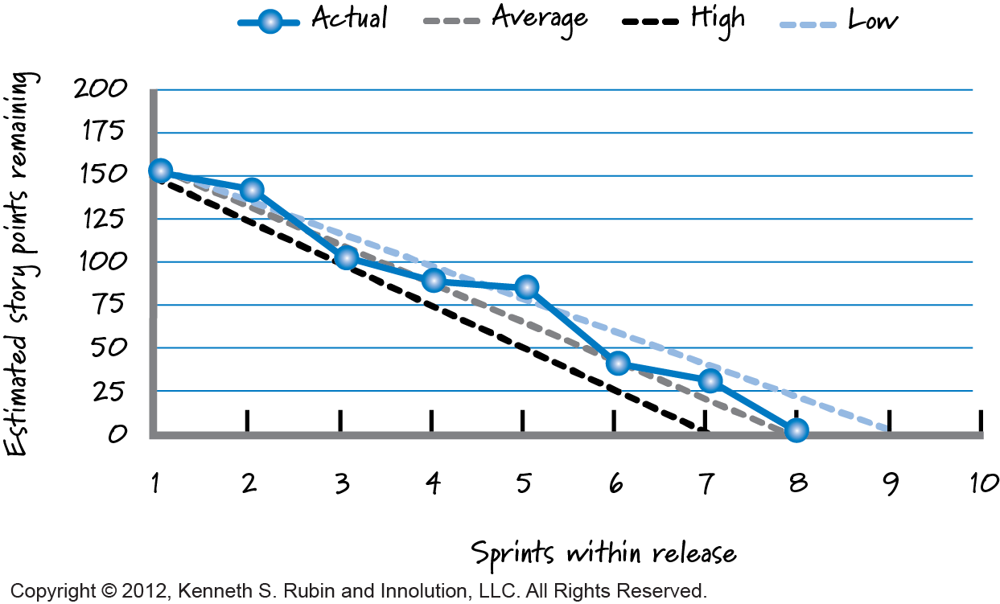

# Product Owner 🤵

**MoSCoW** est une méthode de priorisation des features par analyse de leur importance.

---

## 7 key roles and responsibilities 💡

### Defining the vision

The agile product owner is the point person on the product development team, using their high-level perspective to define goals and create a vision for development projects.

> **Tools**
>
> > _Product Roadmap :_ The product roadmap is a high-level, strategic visual summary that outlines the vision and direction for the product offering over time. It is both a strategic guide for stakeholders to reference as well as a plan for execution.
> > 

---

### Managing the product backlog

One of the most important responsibilities for a scrum product owner is managing the product backlog. This is the development team’s project to-do list.

> **Tools**
>
> > **Higher-priority items** should be refined and have great value to the product.
> >
> > **Mid-priority items** should be candidates for refinement (the process of detailing each task)
> >
> > **Low-priority items** should not be a dependency and can be safely ignored until they are candidates for refinement.
>
> > **Impact Effort** > > 
>
> > **RICE Method :**
> >
> > **Reach:** How many people will this feature affect in a given period? Reach is measured using real product metrics like “customers per quarter” or “transactions per month” to help avoid the bias of picking products or features that you personally want to build.
> >
> > **Impact:** How much will this project move the needle on your goals and strategy? To make this more uniform, Sean uses a multiple-choice scale: 3 for “massive impact”, 2 for “high”, 1 for “medium”, 0.5 for “low”, and finally 0.25 for “minimal”.
> >
> > **Confidence:** Based on what you know, how confident are you that this feature will be a success? Confidence helps back you up if you think a project will be impactful, but don’t have data to back it up. Again, using a simple multiple-choice scale makes this easy: 100% is “high confidence”, 80% is “medium”, 50% is “low”. (And anything below that is “total moonshot”).
> >
> > **Effort:** How much time will the project require from product, design, and engineering teams? You can measure this in “person-months” and stick to whole numbers (with a minimum of half a month).
> >
> > 

---

### Prototype

One of the most important responsibilities for a scrum product owner is managing the product backlog. This is the development team’s project to-do list.

> **Tools :**
>
> > **Zoning :** Comme son nom l’indique, il détermine les grandes zones des pages du site sans détailler leur contenu. Sa fonction consiste à mettre en exergue le premier niveau de lecture et la structure globale des gabarits
>
> > **Wireframe :** est plus détaillé que le _zoning_. Il présente les animations, le fonctionnement de la page et le type de contenus qui composent chaque grande zone de la page. Grâce à lui, vous évaluez l’ergonomie et veillez à ce que l’expérience utilisateur soit optimale.
>
> > **Mockup :** a pour but de montrer l’enchaînement entre les différentes pages du site. Il est donc composé de _zonings_ (ou de _wireframes_) dont les zones sont cliquables pour simuler la navigation. **Son but :** analyser la fluidité du parcours de l’internaute.

---

### Overseeing development stages

With the vision, strategy, and product priorities set, the product owner should spend a significant amount of time overseeing the actual development of the product. They are a key player throughout each event, including planning, refinement, review, and sprint.

> **Tools :**
>
> > **Daily stand up meeting**
>
> > **Burndown chart :**
> >
> > 

---

## Example de présentation 🏃‍

---

**Made by Guillaume with ❤.**
